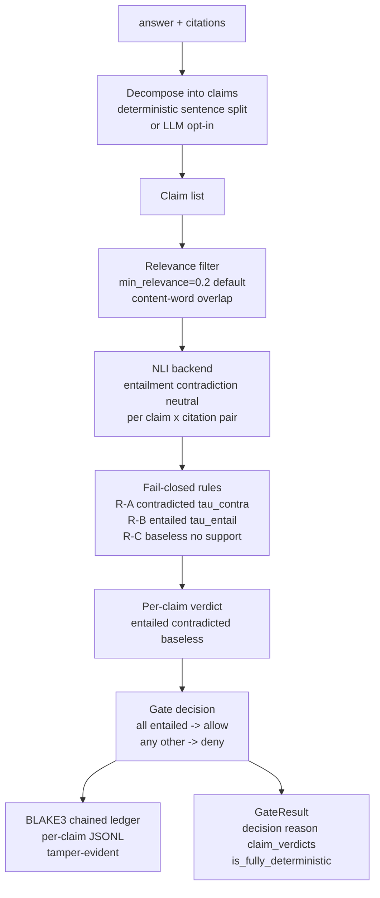

# citelock

**A deterministic, fail-closed citation gate for RAG answers — not a fact-checker.**

citelock splits an answer into claims, uses a local NLI model to label each claim
as *entailed / contradicted / unsupported* by the passages it cites, and **blocks
(fail-closed) any answer that has an unsupported or contradicted claim.** It emits
a per-claim, tamper-evident ledger for CI and audit.

It checks **textual entailment against the provided passages only** — not
real-world truth. It is a *gate*, not a fact-checker, and it inherits its NLI
backend's errors. With the default local backend it uses **no LLM API and no
network at inference time**, and its deterministic path is reproducible.

> Where this sits: Ragas / TruLens / Phoenix score faithfulness and report it;
> DeepEval offers an LLM-judge assertion. citelock does a different job — a
> *deterministic, offline, fail-closed gate* with a per-claim ledger. It is not a
> better faithfulness metric; it is a different tool.

## Architecture



## Install

```bash
pip install citelock            # core: pydantic, syntok, python-ulid, blake3
pip install 'citelock[nli]'     # + the local NLI model backend (torch, transformers)
```

Core has no torch dependency. The local NLI backend runs on **CPU** — no GPU
required.

## Quickstart

The built-in `stub` backend is a transparent lexical heuristic that needs no
model download, so this snippet runs offline out of the box. **Use the `local`
backend for real entailment** (`pip install 'citelock[nli]'`).

```python
from citelock import gate, LexicalStubBackend

backend = LexicalStubBackend()  # demo/test only — not for production gating

result = gate(
    answer="The Eiffel Tower is in Paris. It was completed in 1889.",
    citations=[
        "The Eiffel Tower is a landmark located in Paris, France.",
        "Construction of the Eiffel Tower finished in 1889.",
    ],
    backend=backend,
)
print(result.decision)   # "allow" or "deny"
print(result.reason)
for v in result.claim_verdicts:
    print(v.verdict, "::", v.claim_text)
```

Real entailment with the default MIT model:

```python
from citelock import gate
from citelock.backends import LocalCrossEncoderBackend

result = gate(answer, citations, backend=LocalCrossEncoderBackend())
```

## CLI (use it as a CI gate)

```bash
citelock gate --answer @answer.txt \
  --citation "The sky appears blue due to Rayleigh scattering." \
  --backend local
echo $?     # 0 = allowed, 2 = DENIED, 3 = error
```

`citelock gate` exits **2** on a deny, so it fails a CI step on any unsupported
or contradicted claim. Other commands:

```bash
citelock verify-ledger --ledger run.jsonl   # 0 ok, 2 tampered
citelock sanity --cases-file cases.json --backend local
citelock backends                            # list backends + licenses
```

## How the gate decides

1. **Decompose** the answer into claims (deterministic sentence split by
   default; LLM-assisted decomposition is opt-in and not deterministic).
2. **Relevance filter.** A citation may only vote on a claim if at least
   `min_relevance` (default 0.2) of the claim's content words appear in it.
   NLI models confidently mislabel unrelated passages, so without this a single
   off-topic passage from the retriever would falsely contradict a correct
   answer. (Set `min_relevance=0` to disable.)
3. For each claim × each **relevant** citation, the **NLI backend** returns
   `(entailment, contradiction, neutral)`.
4. **Fail-closed rules** (thresholds recorded in the policy id):
   - **R-A** any relevant citation contradicts ≥ `tau_contra` → **contradicted** (checked first)
   - **R-B** else any relevant citation entails ≥ `tau_entail` → **entailed**
   - **R-C** else → **baseless** (unsupported); a claim with no relevant citation is baseless
5. The answer is **allowed only if every claim is entailed.** Any contradicted
   or unsupported claim, a claim with no on-topic citation, zero claims, too few
   citations, a backend error, or a decomposition error → **deny**. There is no
   path that turns an error into an allow.

## NLI backends and licenses

| selector | model | license |
|---|---|---|
| `stub` | built-in lexical | test/demo only — **do not gate with it** |
| `local` *(default)* | `cross-encoder/nli-deberta-v3-base` | **MIT** |
| `local --model MoritzLaurer/…mnli-fever-anli` | DeBERTa MNLI-FEVER-ANLI | MIT weights; training data includes **ANLI (CC-BY-NC-4.0)** |
| `local --model lytang/MiniCheck-DeBERTa-v3-Large` | MiniCheck | **CC-BY-NC-4.0 (non-commercial)** |
| `llm` (injected) | your provider | provider terms; **non-deterministic, not for gating** |

Only the MIT model is a default. Opt-in models with restrictive training
data print a warning before loading. citelock bundles no LLM SDK; the LLM-judge
backend takes a `completion_fn` you supply, and exists for comparison only.

## Per-claim ledger

Pass `ledger=JsonlLedger("run.jsonl")` (or `--ledger`) to append one entry per
claim plus a gate summary. Entries are chained with a BLAKE3 hash (BLAKE2b
fallback if the `blake3` wheel is absent; the algorithm is recorded in each
entry), and `verify-ledger` detects any after-the-fact edit.

Scope, stated honestly: this is **single-writer tamper-evidence**. It detects
edits to the file. It is not a distributed log, not multi-writer safe, and uses
no `fsync` (best-effort durability).

## Judge-sanity harness

A citation gate is only meaningful if removing the cited passage changes the
verdict. `run_sanity(...)` perturbs inputs and reports, with bootstrap CIs:

- **drop** the supporting citation → an entailed claim should stop being entailed
- **negate** the claim → it should stop being entailed
- **shuffle** the citations → the verdict must be unchanged (a logic property)

A low drop-flip rate means the backend is not reading the citations.

## Determinism — what is and isn't claimed

`GateResult.is_fully_deterministic` is True only when **both** the NLI backend
and every claim decomposition are deterministic. The default local model is a
single forward pass in eval mode with no sampling, so it is deterministic for a
fixed model, hardware, and batch composition; scores may differ in their last
digits across hardware or when the same pair is padded inside a different batch,
which the thresholds almost always absorb. Choosing LLM decomposition or the
LLM-judge backend flips the flag to False — citelock does not claim
reproducibility it cannot keep.

## Evaluation

`eval/run_eval.py` gates a labeled set and reports deny precision/recall/F1,
accuracy, **false-deny rate** (gold-allow blocked — usability cost) and
**false-allow rate** (gold-deny passed — safety cost), each with a bootstrap 95%
CI and an environment stamp. Numbers below are **real, reproducible runs** — no
placeholders.

Measured runs, seed 0, Python 3.12.3, Linux x86_64 (`0.1.0a2`), default
`min_relevance=0.2`.

**Clear-cut set** (`eval/labeled_cases.json`, 30 cases, 1–2 citations each):

| backend | model | accuracy | deny P / R / F1 | false-deny rate |
|---|---|---|---|---|
| `local` *(default)* | cross-encoder/nli-deberta-v3-base | **1.00** (30/30) | 1.00 / 1.00 / 1.00 | 0.00 |
| `stub` | built-in lexical (demo only) | 0.70 | — / 0.67 / — | 0.27 `[0.07, 0.47]` |

These 30 cases are *unambiguous grounding decisions chosen by the author* — a
smoke test of the gate plus the backend, **not a hard benchmark**. A perfect
score means the cases are clear-cut, not that the gate is a fact-checker.

**Noisy-retrieval set** (`eval/distractor_cases.json`, 10 supported answers, each
with 1 relevant + 2 off-topic citations — the realistic RAG case):

| min_relevance | false-deny rate (local) |
|---|---|
| 0.0 (filter off) | **0.90** `[0.70, 1.00]` |
| 0.2 (default) | **0.10** `[0.00, 0.30]` |

This is the honest, important number. With the relevance filter **off**, the
NLI model's confident false-contradictions on off-topic passages deny 9 of 10
correct answers. The default filter cuts that to 1 of 10 — a real, measured ~9x
reduction, but **not zero.** A residual false-deny rate remains and will be
higher on harder data; measure it on yours before trusting the gate in
production.

**The other side of the filter** (`eval/contradiction_recall_cases.json`, 12
wrong answers whose retrieved passages contradict them, `gold=deny`):

| min_relevance | false-allow rate (local) |
|---|---|
| 0.2 (default) | **0.17** `[0.00, 0.42]` (2/12) |
| 0.0 (filter off) | **0.00** (0/12) |

This is the **cost** of the filter, measured. By dropping off-topic passages it
also drops a genuine contradiction that happens to be phrased without the
claim's words, so 2 of these 12 wrong answers are allowed through at the default
setting; with the filter off, all 12 are correctly denied. The relevance filter
is therefore a **policy-controlled trade-off** — distractor robustness (low
false-deny) vs contradiction recall (low false-allow) — not a free win. Raise
`min_relevance` for the former, lower it for the latter, and measure both on
your data. (A dropped contradiction still appears in the claim's `evidence` with
`relevant=False`, so it is visible to an auditor even when it did not vote.)

Reproduce:

```bash
python eval/run_eval.py --backend local                                  # clear-cut set
python eval/run_eval.py --backend local --cases eval/distractor_cases.json
python eval/run_eval.py --backend local --cases eval/distractor_cases.json --min-relevance 0
python eval/run_eval.py --backend local --cases eval/contradiction_recall_cases.json
```

**On public datasets:** RAGTruth (MIT) and ExpertQA (MIT) are appropriate
external benchmarks. They are **not redistributed** here and their full runs are
**not yet done** for this alpha — so no numbers from them are claimed. Mapping
their span/claim annotations onto citelock's per-claim verdict is non-trivial and
will land with measured, stamped numbers in a later release rather than rushed,
misleading ones.

## Limitations

- Entailment ≠ truth. A claim entailed by a wrong passage is allowed; citelock
  gates *grounding in the cited text*, nothing more.
- **Off-topic passages and false-deny.** NLI models score unrelated passages as
  confident *contradictions*, not neutral (e.g. a passage about Saturn scored
  0.97 "contradiction" against a claim about Paris). The relevance filter
  mitigates this but does not eliminate it; the residual false-deny rate (~0.10
  on the noisy-retrieval set above) is the gate's main usability cost. A
  relevance-scoped contradiction model is planned. Measure your own false-deny
  rate.
- **The relevance filter cuts both ways.** It is lexical content-word overlap,
  so a genuine contradiction phrased with no shared vocabulary is filtered out
  too. Measured cost: on the contradiction-recall set above it lets **2 of 12**
  wrong answers through (false-allow 0.17) at the default `min_relevance=0.2`,
  versus **0 of 12** with the filter off. This is a real safety/usability
  trade-off you tune with `min_relevance`, not a free win.
- **Tokenization is whitespace + Unicode word characters.** It works for
  space-delimited scripts (Latin incl. accents, Cyrillic, Greek, …). Scripts
  written without spaces between words (CJK, Thai, …) are not segmented, so the
  relevance filter cannot judge overlap there — use `min_relevance=0` with a
  backend you trust, or supply your own tokenizer. Stopwords are English-only.
- Sentence-level decomposition: a sentence with two facts is one claim in the
  alpha. Finer decomposition is opt-in (LLM, non-deterministic).
- NLI is applied per passage; multi-hop claims spanning several passages are not
  yet aggregated.

## License

MIT. See [LICENSE](LICENSE). citelock reuses the
*design ideas* of the author's MIT-licensed project `subjunctor`; no subjunctor
source code is included.
